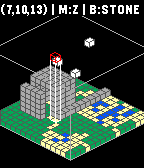

# block-world

Simple 'block-builder' game for Pebble SDK 3.0

Uses modified [PGE](https://github.com/C-D-Lewis/pge) and isometric libraries to
show a grid of 16 x 16 x 14 blocks that can be placed by the user.

## How to Use

Up - Switch axis through X, Y, Z and B (Block type)

Down - Move through current axis

Select - Place current block type at current position